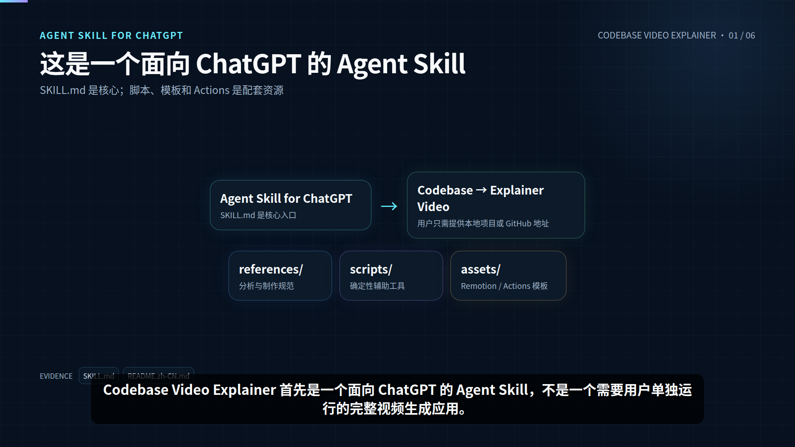

# Codebase Video Explainer

**English** | [简体中文](README.zh-CN.md)

**Codebase Video Explainer is a Codex plugin that bundles an Agent Skill for turning software repositories into evidence-backed developer explainer videos.**

Give Codex a local project or GitHub repository. The bundled Skill analyzes the codebase, builds a verified mental model, creates a developer-focused storyboard, generates natural Chinese narration and exact subtitles, and renders a final MP4 with Remotion.

## Video demo

[](docs/media/codebase-video-explainer-demo.mp4)

[Watch or download the MP4](docs/media/codebase-video-explainer-demo.mp4)

## Install in Codex

### 1. Add the marketplace

```bash
codex plugin marketplace add ythc/codebase-video-explainer --ref main
```

Optional check:

```bash
codex plugin marketplace list
```

### 2. Install the plugin

Start Codex:

```bash
codex
```

Open:

```text
/plugins
```

Choose **Codebase Video Explainer** and select **Install plugin**.

Start a new Codex session after installation.

## Use it

Ask Codex naturally:

```text
Analyze this GitHub repository and create a Chinese developer explainer video.
```

Or:

```text
Use Codebase Video Explainer to explain this codebase for a new developer and render the walkthrough with Remotion.
```

No manual script execution is required for normal use.

## What it does

- **Analyze** — scan the repository, identify important modules, and trace representative execution paths.
- **Explain** — build an evidence-backed architecture model and developer-oriented storyboard.
- **Narrate** — generate natural Chinese narration and exact subtitle timing.
- **Render** — produce a real Remotion video when available, with supported fallbacks when necessary.
- **Verify** — check audio, subtitle, and video timing before delivery.

## Output

Generated work is kept under `.codebase-video/` in the target repository:

```text
.codebase-video/
├── project-analysis.json
├── architecture.mmd
├── architecture.svg
├── storyboard.json
├── narration.zh-CN.md
├── narration.mp3
├── timings.json
├── storyboard.timed.json
├── subtitles.srt
├── remotion/
└── output.mp4
```

## Plugin layout

```text
.agents/plugins/marketplace.json

plugins/codebase-video-explainer/
├── plugin.json
├── .codex-plugin/
│   └── plugin.json
└── skills/
    └── codebase-video-explainer/
        ├── SKILL.md
        ├── agents/
        ├── scripts/
        ├── references/
        └── assets/
```

The top-level README and `docs/media/` are repository documentation. The bundled Skill itself lives under `plugins/codebase-video-explainer/skills/codebase-video-explainer/`.

## Update

```bash
codex plugin marketplace upgrade codebase-video-explainer
```

Then start a new Codex session.

## Safety

The Skill avoids exposing secret-like files and credentials in analysis, narration, screenshots, generated assets, and logs. Generated artifacts are kept separate from production source code whenever possible.
